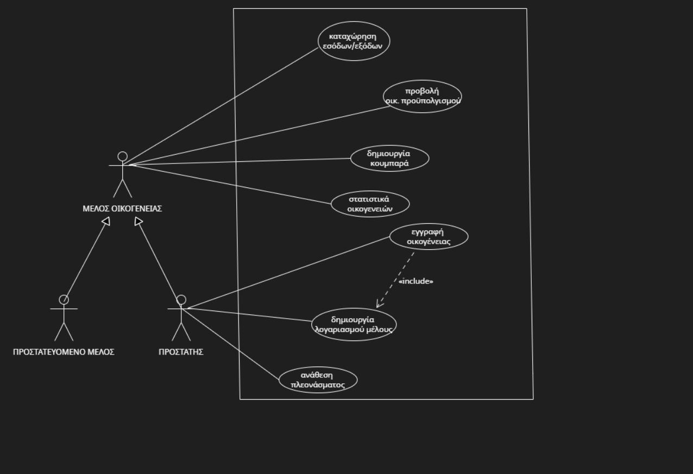

## Εφαρμογή διαχείρισης οικογενειακού προϋπολογισμού

Στη σύγχρονη εποχή η βέλτιστη διαχείριση των οικογενιακών οικονομικών πόρων αποτελεί καίριο ζήτημα. Έτσι, η ανάπυτυξη βοηθητικού λογισμικού κρίνεται ζωτική.

Ένα τέτοιο λογισμικό, θα πρέπει να παρέχει μια ολίστικη εικόνα για τα οικονομικά της οικογένειας, δίνοντας τη δυνατότητα συμμετοχής σε κάθε μέλος μέσω της καταχώρισης στοιχείων για τις εισροές/εκροές και της δημιουργίας στόχων. Επιπρόσθετα, θα πρέπει να προσφέρεται πληθώρα πληροφοριών σχετικά με τον οικογενειακό προϋπολογισμό καθώς και πρόσβαση σε οικονομικές στατιστικές αναφορές.

## Απαιτήσεις λογισμικού

***Λειτουργικές:***

---

1. Καταχώριση και ομαδοποίηση επαναλαμβανόμενων (παγίων) εξόδων.
2. Καταχώριση μηνιαίου εισοδήματος.
3. Υπολογισμός διαθέσιμου εισοδήματος.
4. Υπολογισμός δόσεων δανείου και επιβάρυνσης.
5. Εγγραφή οικογένειας από μέλος-προστάτης.
6. Δημιουργία λογαριασμού για κάθε μέλος της οικογένειας από τον προστάτη.
7. Διαχείριση οικογενειακού προϋπολογισμού με συμμετοχή όλων των μελών.
8. Καταχώριση έκτακτων εσόδων/ εξόδων από κάθε μέλος.
9. Κατηγοριοποίηση εσόδων/ εξόδων.
10. Προβολή στοιχείων οικογενειακού προϋπολογισμού από όλα τα μέλη.
11. Δημιουργία κουμπαρά από όλα τα μέλη.
12. Ανάθεση μέρους πλεονάσματος στον κουμπαρά από προστάτη.
13. Καταγραφή αποταμίευσης ανά μήνα.
14. Προβολή στατιστικών στοιχείων οικογενειακών προϋπολογισμών.

---

[***Μη λειτουργικές:***](docs/markdown/non-functional.md)

---

1. Ταχεία απόκριση στα αιτήματα χρήστη.
2. Εύχρηστο και κατανοητό UI.
3. Προστασία προσωπικών δεδομένων από υποκλοπές.
4. Διαθέσιμη εφαρμογή ανά πάσα στιγμή.
5. Άμεση εκσφαλμάτωση.
6. Παροχή πρόσβασης στην εφαρμογή ανεξαρτήτως λογισμικού.

---

## Διάγραμμα περιπτώσεων χρήσης

[this diagram can also be found here](docs/uml/requirements/use-case-diagram.png)

## Περιπτώσεων χρήσης

[***ΠΧ 1. Kαταχώρηση εσόδων/εξόδων:***](docs/markdown/use_case_kataxwrish.md)
Είναι η βασική λειτουργικότητα που επιτρέπει στον χρήστη την δυνατότητα να καταχωρεί έξοδα/έσοδα και να τα κατηγοροιοποιεί ως προς την συχνότητα και την προέλευση τους. Τα έσοδα/έξοδα έχουν την δυνατότητα να είναι πάγια ή έκτακτα. Τα πάγια μηνιαία έσοδα/έξοδα χαρακτηρίζονται από το ποσό, τον μήνα έναρξης καθώς και τον μήνα λήξης τους. Τα έκτακτα έσοδα/έξοδα έχουν μόνο το ποσό. Πάγια εσόδων είναι για παράδειγμα ο μισθός ή κάποιο ενοίκιο από την μίσθωση ενός ακινήτου και πάγια έξοδα είναι ο λογαριασμός κινητής ή η συνδρομή σε μια υπηρεσία streaming. Έκτακτα έξοδα για παράδειγμα είναι η επισκευή του αυτοκινήτου καθώς έκτακτα έσοδα είναι για παράδειγμα η πώληση ενός παλιού Η/Υ. 'Ολα τα έσοδα/έξοδα ανήκουν σε κάποια κατηγορία, ανάλογα με το είδος τους (πχ. μισθοί, λογαριασμοί, ενοίκια).  
[Activity diagram](docs/markdown/uml/requirements/activity_register_income.uxf)  
[Sequence diagram](docs/uml/requirements/sequence-register-income.png)

[***ΠΧ 2. Προβολή οικογενειακού  προϋπολογισμού :***](docs/markdown/use_case_probolh_budget.md)
Τα μέλη κάθε οικογένειας μπορούν να προβάλουν στοιχεία του οικογενειακού προϋπολoγισμού. Όλα τα μέλη θα μπορούν να δουν τα συνολικά έσοδα/έξοδα της οικογένειας καθώς και τα συνολικά έσοδα/έξοδα του ίδιου. Τα μέλη θα μπορούν να ταξινομήσουν τον προϋπολoγισμό που θέλουν να προεπισκοπίσουν χρονολογικά (εβδομαδιαία, μηνιαία,ετήσια).  
[Activity diagram](docs/markdown/uml/requirements/activity_balance.uxf)  
[Sequence diagram](docs/uml/requirements/family_budget.PNG)

[***ΠΧ 3. Δημιουργία λογαριασμού μελών:***](docs/markdown/create_account.md)
Η εφαρμογή θα υποστηρίζει την χρήση από πολλά άτομα, το καθένα με τον προσωπικό του λογαριασμό. Ο προστάτης της οικογένειας θα έχει τον ρόλο του κύριου χρήστη (administrator) και θα είναι υπεύθυνος για την δημιουργία των λογαριασμών των υπόλοιπων μελών. Η δημιουργία λογαριασμών για μέλη θα είναι αποκλειστικό προνόμειο του προστάτη.  
[Activity diagram](docs/markdown/uml/requirements/activity_create_account.uxf)  
[Sequence diagram](docs/uml/requirements/create_member.PNG)

[***ΠΧ 4. Εγγραφή οικογένειας:***](docs/markdown/eggrafh_oikogeneias.md)
Οι προστάτες κάθε οικογένειας θα έχουν την δυνατότητα να εγγράψουν την οικογένεια τους σε αυτή την υπηρεσία δημιουργώντας προφίλ της οικογένιας τους και λογαρισμούς προστάτη στο προφίλ αυτό.  
[Activity diagram](docs/markdown/uml/requirements/activity_register_family.uxf)  
[Sequence diagram](docs/uml/requirements/register_fam.PNG)

[***ΠΧ 5. Δημιουργία κουμπαρά:***](docs/markdown/CREATE_PIGGYBANK.md)
Το κάθε μέλος θα μπορεί να δημιουργεί ψηφιακούς κουμπαράδες με σκοπό την συγκέντρωση ενός καθορισμένου χρηματικού ποσού για την επίτευξη μιας αγοράς. Όλα τα μέλη έχουν την δυνατότητα δημιουργίας κουμπαρά (ενός ή πολλαπλών).  
[Activity diagram](docs/markdown/uml/requirements/activity_piggybank.uxf)  
[Sequence diagram](docs/uml/requirements/sequence-create-piggy-bank.uxf)

[***ΠΧ 6. Ανάθεση πλεονάσματος:***](docs/markdown/ana8esh_pleonasmatos.md)
Στο τέλος κάθε μήνα ο προστάτης της οικογένειας θα έχει την δυνατότητα να προσκομίσει ένα μέρος (ή και ολόκληρο) του πλεονάσματος (εάν και εφόσον αυτό υπάρχει) στον κουμπαρά της επιλογής του.
[sequence-diagram](docs/uml/SequenceAllocateDisposable.png)

[***ΠΧ 7. Στατιστικά οικογενειών:***](docs/markdown/probolh-statistikwn.md)
Όλα τα μέλη κάθε οικογένειας θα μπορούν να προβάλλουν στατιστικά στοιχεία για την οικονομική κατάσταση άλλων οικογενειών, όπως ποσοστό οικογενειών (προφανώς εγγεγραμένων στην υπηρεσία) που έχουν έλλειμα ή ποσοστό οικογενειών που αποταμιεύει πάνω από 1000 ευρώ τον χρόνο. Ακόμα θα μπορούν να προβάλλουν τα στατιστικά του λογαριασμού τους τον προηγούμενο μήνα, χρόνο κτλ.

---
## ΠΑΡΑΔΟΧΕΣ

1. Θεωρούμε ότι η αποταμίευση καταγράφεται κάθε πρώτη του μήνα και το έλλειμα μειώνει την αποταμίευση.
2. Θεωρούμε ότι τα έξοδα που αφορούν όλοι την οικογένεια είναι έξοδα που "ανήκουν στον προστάστη".  

[***Το domain model μπορεί να βρεθέι εδώ.***](docs/uml/requirements/analysis-classes.uxf)
## Στατική όψη λογικής 
[Στατική όψη .png](docs/uml/requirements/static_logic.PNG)

## Code coverage
[Code coverage png can be found here](docs/uml/requirements/coverage.png)
